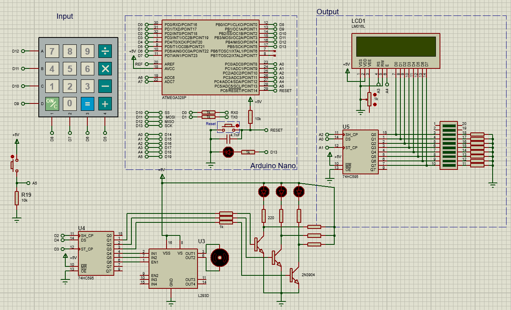

# MCU Final project
An alarm system that requires a password and has a display to show the current state.

# Features
* Implements a [custom library](src/lcdSIPO) for communicating with a LCD display through an 8-bit serial-in parallel-out shift register (54HC595).
* Obtains a password from the use through a keypad.
* Alarm through a motor and LED's.
* Receives a signal from a PIR motion sensor.
* ~~Dude didn't know about state machines, forgive him lol.~~

## Schematics
